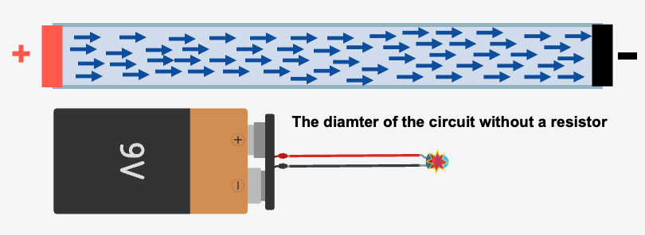
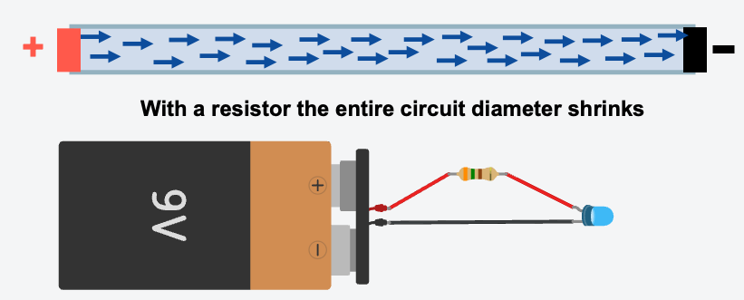

# Circuit Explorer Series: Lesson 2: The Safety Guard (Resistors)

## The Water Pipe Analogy

Before we start, let's look at a new way to think about electricity. Imagine electricity is water flowing through a pipe.

- **Resistor as a Pipe Sizer:** Instead of a "kink," think of a resistor as a pipe sizer. By changing the diameter of the entire pipe, it forces the water (current) to flow at a safe, steady speed all the way around the loop.
- **Wider Pipe (Low Resistance):** The water flows fast and easily.
- **Narrower Pipe (High Resistance):** It is harder for the water to get through, slowing down the flow for the entire circuit.

---

## Objective

By the end of this lesson, the student will be able to:

1.  Identify an LED (Light Emitting Diode) and understand that it is sensitive to high voltage.
2.  Predict what happens when an LED is connected directly to a 9V battery.
3.  Use a resistor to protect the LED and observe how it changes the brightness.

---

## Lesson Content

### Step 1: The "Pop" (The Danger of Too Much Power)

- **Concept**: LEDs are very sensitive components and cannot handle the full pressure (Voltage) of a 9V battery. They need a "safety guard."
- **Activity**:
  1.  Place a 9V battery and a Red LED in Tinkercad Circuits.
  2.  Connect the Red (Positive) wire directly to the LED's Anode (bent leg).
  3.  Connect the Black (Negative) wire directly to the LED's Cathode (straight leg).
  4.  Click "Start Simulation."
- **Observation**: An explosion icon appears above the LED, indicating it has "popped" and broken.

<video
  src="video/L02/01-Overview-and-Step-1-The-Pop.mp4"
  controls
  playsinline
  preload="metadata"
  width="100%"
  style="max-width: 900px; height: auto; border-radius: 8px;">
Your browser does not support the video tag.
<a href="video/L02/01-Overview-and-Step-1-The-Pop.mp4">Download the video</a>.
</video>

### Step 2: Introducing the Resistor (The Gatekeeper)

- **Concept**: A resistor acts as a pipe sizer, changing the diameter of the path to slow down the flow of electricity (Current). It acts as a gatekeeper for the sensitive LED.
- **Activity**:
  1. Click "Stop Simulation."
  2. Add a Resistor to your workspace.
  3. Connect it in-line between the battery's positive terminal and the LED's Anode.
  4. Click "Start Simulation" again.
- **Observation**: The LED now turns on safely and stays lit!

<video
  src="video/L02/02-Step-2-Add-A-Resistor.mp4"
  controls
  playsinline
  preload="metadata"
  width="100%"
  style="max-width: 900px; height: auto; border-radius: 8px;">
Your browser does not support the video tag.
<a href="video/L02/02-Step-2-Add-A-Resistor.mp4">Download the video</a>.
</video>

### Step 3: Tinkering with Brightness

- **Concept**: You can control the brightness of the LED by changing the resistor's value, which is measured in **Ohms (Ω)**.
- **Activity**:
  1.  Click on the resistor and change its value to **100 Ω**. Click "Start Simulation." (The LED is very bright).
  2.  Stop the simulation and change the resistor value to **10,000Ω (10k)**. Click "Start Simulation." (The LED is very dim).
- **Conclusion**: The higher the number of Ohms, the more the resistor restricts the flow (making the pipe narrower), and the dimmer the LED becomes.

<video
  src="video/L02/03-Step-3-Changing-The-Brightness.mp4"
  controls
  playsinline
  preload="metadata"
  width="100%"
  style="max-width: 900px; height: auto; border-radius: 8px;">
Your browser does not support the video tag.
<a href="video/L02/03-Step-3-Changing-The-Brightness.mp4">Download the video</a>.
</video>

### Step 4: Decoding the "Shorthand" (The Letter Code)

- **Concept**: Scientists use letters to avoid writing too many zeros. These are like math "shortcuts."
  - **k** = Kilo (Thousands). **1k&Omega;** is **1,000 &Omega;**.
  - **m** = Milli (Thousandths). **1m&Omega;** is **0.001 &Omega;**.
  - **&mu;** = Micro (Millionths). **1&mu;&Omega;** is **0.000001 &Omega;**.
- **Activity**: Look at the dropdown menu in Tinkercad.
  - If you see **M&Omega;** (Mega), that is a **Million**. That pipe is so tight that almost no electricity can get through!
- **The Rule**:
  - **Bigger letters (M, G, k)** = More resistance (The pipe is getting tighter).
  - **Little letters (m, &mu;, n, p)** = Less resistance (The pipe is getting wider).

| Prefix   | Name  | Symbol      | Value (&Omega;)        |
| :------- | :---- | :---------- | :--------------------- |
| **G**    | Giga  | G&Omega;    | 1,000,000,000 &Omega;  |
| **M**    | Mega  | M&Omega;    | 1,000,000 &Omega;      |
| **k**    | Kilo  | k&Omega;    | 1,000 &Omega;          |
| -        | Base  | &Omega;     | 1 &Omega;              |
| **m**    | milli | m&Omega;    | 0.001 &Omega;          |
| **&mu;** | micro | &mu;&Omega; | 0.000001 &Omega;       |
| **n**    | nano  | n&Omega;    | 0.000000001 &Omega;    |
| **p**    | pico  | p&Omega;    | 0.000000000001 &Omega; |
