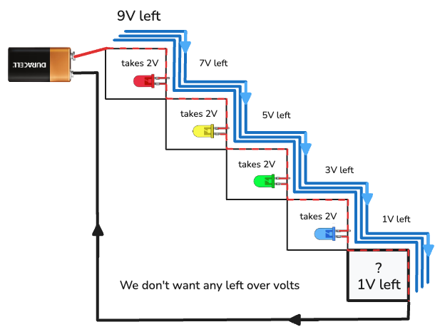
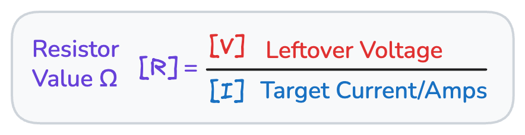
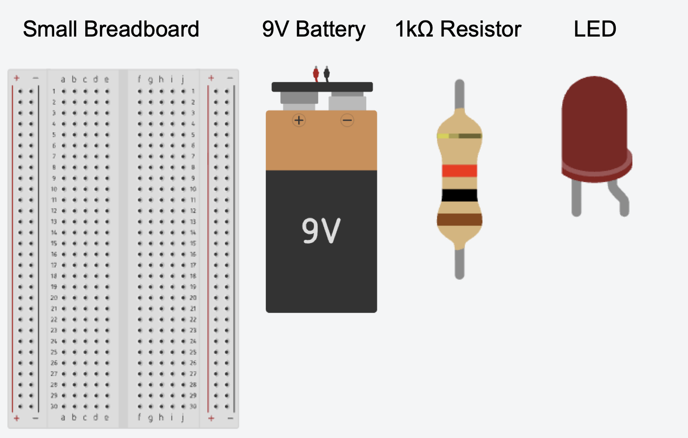

# Circuit Explorer Series: Lesson 3: The Breadboard & Ohm’s Law

## Lesson Content

### Step 1: Rebuilding and The Breadboard

- **Concept**: Before we move to a cleaner workspace, we will practice our circuit construction and learn a simulation shortcut. Then, we will transition to a breadboard.
- **Activity**:
  1. Rebuild the Lesson 2 circuit (9V Battery &larr; 1k&Omega; Resistor &larr; LED) in Tinkercad.
  2. Add a Push Button between the battery and the resistor.
  3. **Simulation Trick**: To keep the button "pressed" during the simulation without your mouse, hold the **Shift** key while clicking the button. This "locks" the button in the pushed position.
  4. Stop the simulation and delete all existing wires to clear your workspace.
  5. Bring a **Breadboard** into the workspace.
  6. Connect the 9V battery terminals to the breadboard's power rails.
  7. Connect jumper wires from the positive and negative rails on one side of the breadboard to the corresponding rails on the opposite side to ensure current flows everywhere.

<video
  src="video/L03/01-9V-to-Breadboard.mp4"
  controls
  playsinline
  preload="metadata"
  width="100%"
  style="max-width: 900px; height: auto; border-radius: 8px;">
Your browser does not support the video tag.
<a href="video/L03/01-9V-to-Breadboard.mp4">Download the video</a>.
</video>

### Step 2: Breadboard Assembly

- **Concept**: Professionalizing our circuit by placing components into the breadboard grid.
- **Activity**:
  1. Place the Push Button so it bridges the center gap of the breadboard.
  2. Place the Resistor so one leg connects to a terminal row of the button.
  3. Place the LED so its Anode (bent leg) connects to the other leg of the resistor.
  4. Connect the Cathode (straight leg) of the LED back to the negative rail of the breadboard.
  5. Use jumper wires to complete the path from the positive rail to the button.
  6. Click "Start Simulation" and use the **Shift + Click** trick to test the circuit.

<video
  src="video/L03/02-Wiring-The-Breadboard-Circuit.mp4"
  controls
  playsinline
  preload="metadata"
  width="100%"
  style="max-width: 900px; height: auto; border-radius: 8px;">
Your browser does not support the video tag.
<a href="video/L03/02-Wiring-The-Breadboard-Circuit.mp4">Download the video</a>.
</video>

### Step 3: The Battery’s "Toll Booths" (Voltage Drop)

- **Instructor Note**: Move beyond the "squeezed pipe" to explain that a resistor doesn't just block flow in one spot—it changes the "speed" of the entire circuit. Also, introduce the idea that every component (LEDs) "takes" a specific amount of voltage as it works.

- **Concept**: Think of the 9V battery as a car trip with 9 units of energy.
  - If you just connect a wire, the "current" flows too fast and "crashes" the circuit.

<video
  src="video/L03/03-Single-Wire-Loop.mp4"
  controls
  playsinline
  preload="metadata"
  width="100%"
  style="max-width: 900px; height: auto; border-radius: 8px;">
Your browser does not support the video tag.
<a href="video/L03/03-Single-Wire-Loop.mp4">Download the video</a>.
</video>

- When you add a resistor, it’s like putting a speed limit on the whole road—the entire circuit slows down to a safe speed.

<video
  src="video/L03/04-Loop-with-1kohm-resistor.mp4"
  controls
  playsinline
  preload="metadata"
  width="100%"
  style="max-width: 900px; height: auto; border-radius: 8px;">
Your browser does not support the video tag.
<a href="video/L03/04-Loop-with-1kohm-resistor.mp4">Download the video</a>.
</video>

- **The "Toll Booth" Rule**: Every LED acts like a toll booth. To turn on, it _must_ take 2 volts of energy from the battery.
- **The Waterfall Activity (4 LEDs)**:
  1. Imagine 9V of energy at the top of a waterfall.
  2. The 1st LED takes 2V (9V - 2V = 7V left).
  3. The 2nd LED takes 2V (7V - 2V = 5V left).
  4. The 3rd LED takes 2V (5V - 2V = 3V left).
  5. The 4th LED takes 2V (3V - 2V = 1V left).
- **Discussion**: If we had 5 LEDs, we wouldn't have enough energy left! The last one would be too dim to light up.

> Note: the LED color change is for visual use. Refer to the LED Color Table in Step 6 for accurate color voltage.

### Step 4: Picking the Right Resistor (The "Goldilocks" Math)

- **Concept**: The resistor’s job is to "soak up" the leftover voltage so the LEDs don't get too much and "pop."
- **The Math (Simplified)**:
  1. Start with the Battery Power: **9V**.
  2. Subtract the "Tolls" taken by the LEDs: **8V** (4 LEDs × 2V each).
  3. That leaves **1V** that the resistor needs to "soak up" to keep the circuit safe.
- **The Activity**:
  1. If we have too much leftover voltage, we use a **bigger** resistor to soak it up.
  2. If we have almost no leftover voltage, we use a **smaller** resistor.
- **Scientist Challenge**: If you had a 9V battery and only **one** LED (that takes 2V), how much energy is "leftover" for the resistor to soak up? (Answer: 7V). Do we need a bigger or smaller resistor than the one we used for 4 LEDs?

### Step 5: Finding the "Flow" (Current/Amps)

- **Instructor Note**: Professionals do not guess; they look up the "Datasheet" for a part before building. In this lesson, we are specifically working with standard LEDs.

- **The "Three-Jump Rule"**: To change **milliamps (mA)** into **Amps (A)** for our math, imagine a decimal point at the end of your number and jump it 3 spots to the left:
  - Start with: **20**
  - Jump 1: **2.0**
  - Jump 2: **.20**
  - Jump 3: **.020**
  - **Result: 0.020A**

- **Tinkercad Tip**: If you ever forget the standard amperage for an LED, you can "overload" the circuit in Tinkercad until the LED pops. If you hover your mouse over the "popped" LED, a small note will appear telling you: "Current through the LED is X, while absolute maximum is 20mA." That **20mA** is your "Magic Number."

<video
  src="video/L03/L03-TinkerCAD-Find-Component-Amperage.mp4"
  controls
  playsinline
  preload="metadata"
  width="100%"
  style="max-width: 900px; height: auto; border-radius: 8px;">
Your browser does not support the video tag.
<a href="video/L03/L03-TinkerCAD-Find-Component-Amperage.mp4">Download the video</a>.
</video>

### Step 6: Ohm’s Law (The Resistor Balance)

- **Concept**: Now we use a simple equation to pick the perfect resistor so our LED gets exactly the flow it needs without popping.
- **The Equation**:
  Ω Resistor Value (R) = Leftover Voltage (V) ÷ Target Current / Amps (I)

  > The letter (I) is used instead of (A) or "Current/Amps" to mean **"Instensity"**

- ### **Experiment 1: The Single LED Test**

Build a circuit on a Small Breadboard with a 9V battery, a 1kΩ resistor, and 1 LED.

#### Instructions

1. Start by connecting the positive and negative ends of the 9v to the breadboard.
2. Then add a 1kΩ (the default) resistor to the board.
3. Connect the power to one end of the resistor.
4. Add an LED after the resistor. Make sure to rotate the LED correctly so the resistor end is touching the "Anode".
5. Then from the LED Cathode side insert a **Multimeter**.
6. Finish by connecting the Multimeter to the ground to complete the circuit.

**The Math**:

- **Starting Voltage (V)**: 9v battery
- **1 LED:**
  - Takes 2v to run
  - Allows for a max of 20mA or 0.020 (I)
- **Goal:** Multimeter reads 20mA when measureing Amperage
- **Formula:**
  - **Leftover Voltage:** (9v - 7v) = 2v
  - **Target Current/Amps:** 20mA or 0.020

<video
  src="video/L03/L03-Exp-01-Find-The-Resistance-to-Produce-20m.mp4"
  controls
  playsinline
  preload="metadata"
  width="100%"
  style="max-width: 900px; height: auto; border-radius: 8px;">
Your browser does not support the video tag.
<a href="video/L03/L03-Exp-01-Find-The-Resistance-to-Produce-20m.mp4">Download the video</a>.
</video>

**Review:**
The LED takes 2v for use from the 9v battery. The the resistor needs eat up the remaining 7 volts. We know the LED has a max of 20mA or 0.020 amps for max brightness. So, we divide `(7 / 0.020)` to get `350Ω`. This shows 19.7mA.

- ### **Experiment 2: The 3 LED Series Chain**

For this experience the goal is to keep the current circuit but add in 2 additional LED's while still displaying about 20mA on the multimeter. For this experiment set all **LED's to Red**. Otherwise, you will get a much lower return on amperage. The table below shows each LED's voltage requirement.

| LED Color  | Typical _Forward Voltage_ (Vf) |
| :--------- | :----------------------------- |
| **Red**    | 1.8V – 2.2V                    |
| **Orange** | 2.0V – 2.2V                    |
| **Yellow** | 2.0V – 2.4V                    |
| **Green**  | 2.9V – 3.5V                    |
| **Blue**   | 3.0V – 3.5V                    |
| **White**  | 3.0V – 3.5V                    |

<video
  src="video/L03/L03-Exp-02-LED-Series.mp4"
  controls
  playsinline
  preload="metadata"
  width="100%"
  style="max-width: 900px; height: auto; border-radius: 8px;">
Your browser does not support the video tag.
<a href="video/L03/L03-Exp-02-LED-Series.mp4">Download the video</a>.
</video>

- ### **Experiment 3: Multi-Colored LED Series Chain**

Take a look at the LED Color table. Change the colors around on the LED Chain Circuit from Experiment 2. Try swapping out the colors with different combinations to see if you can stay around 20mA. Apply the formula for finding the correct resistance. Have fun!

## **Quick Recap**:

- **Look it up**: Always check your device's "Goldilocks" flow (20mA for LEDs).
- **Jump the Decimal**: Use the "Three-Jump Rule" to turn 20mA into 0.020A.
- **Find the Toll**: Subtract the LED voltage "tolls" from the battery voltage to find the leftover voltage the resistor needs to soak up.
- **Calculate**: Use the equation (Leftover Voltage ÷ 0.020) to find your perfect resistor value.
