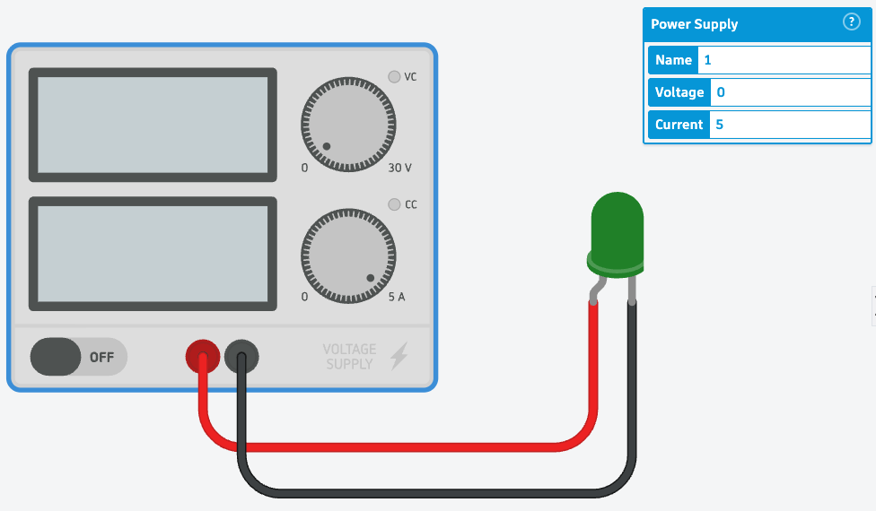
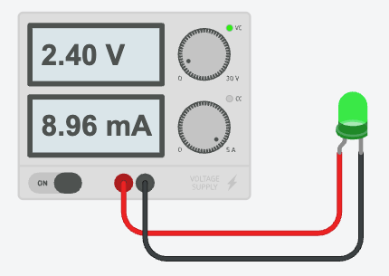

### Circuit Explorer Series: Lesson 4: The Battery Optimization Challenge

## Objective

By the end of this lesson, the student will be able to:

1. Recalculate resistor values for a 9V power source to protect multiple LEDs.
2. Demonstrate how to build a custom power source by combining smaller batteries to improve efficiency.

---

## Lesson Content

### Step 1: Recap and Build (The 9V Challenge)

- **Concept**: Recall that components have specific "needs." An LED needs a specific "push" (voltage) and "flow" (current) to shine brightly without burning out.

- **Activity**:
  1. Build a circuit on your breadboard with a **9V battery**, a **resistor**, and **two LEDs** (one Red, one Green).
  2. Use your notes from Lesson 3 to find the voltage requirement for each LED.
  3. Calculate and place the correct resistor to get each LED to its maximum brightness without damaging them.
  4. Use the **Multimeter** to verify your "flow" (current) is within the safe range.

### Step 2: Engineer's Detective Resources

- **Concept**: When you encounter a new part, don't guess its requirements—research them! Use these professional databases to find the "datasheets" (recipe cards) for your components:
  - [AllDatasheet](https://www.alldatasheet.com)
  - [Datasheets.com](https://www.datasheets.com)
  - [Ultra Librarian](https://www.ultralibrarian.com)

| LED Color                                    | Typical _Forward Voltage_ (Vf) |
| :------------------------------------------- | :----------------------------- |
| **Red**     | 1.8V – 2.2V                    |
| **Orange**                                   | 2.0V – 2.2V                    |
| **Yellow**                                   | 2.0V – 2.4V                    |
| **Green** | 2.9V – 3.5V                    |
| **Blue**                                     | 3.0V – 3.5V                    |
| **White**                                    | 3.0V – 3.5V                    |

### Step 3: The "Overkill" Question and Custom Power

- **Problem**: Is a 9V battery always necessary? Sometimes, 9V is like using a firehose to water a tiny houseplant. It is "too much" energy, which forces us to use a huge resistor to waste all that extra power.
- **Activity**:
  1. Watch the short video on how to use the **1.5V Battery** component in Tinkercad.

<video
  src="video/L04/Battery-1.5v-up-to-6v.mp4"
  controls
  playsinline
  preload="metadata"
  width="100%"
  style="max-width: 900px; height: auto; border-radius: 8px;">
Your browser does not support the video tag.
<a href="video/L04/Battery-1.5v-up-to-6v.mp4">Download the video</a>.
</video>

2. Learn how to "stack" (copy/paste) these batteries to create exactly the amount of voltage you need (e.g., 3V, 4.5V, or 6V).
3. **The Challenge**: Replace your 9V battery with a smaller, custom-built power pack. Recalculate your resistor value to match this new, lower voltage.

### Step 4: Simulator Safety and Component Verification

- **Concept**: Tinkercad is a "pretend world" on the computer. It is a safe place to test your ideas. If you give a part a little too much current, a small info sign (ℹ️) pops up to tell you the part is getting stressed. If you give it _way_ too much, some parts will show a pop or explosion sign (💥) to show they would break. But don't worry — nothing really breaks in the pretend world! In the real world, a part like an LED can truly pop and stop working forever. That is why real engineers are extra careful.

- **Activity 1: The Simulator "Stress Test"**
  1. **Setup**: Place a **Power Supply** and a **Green LED** on the workspace.
  2. **Configuration**:
     - Set the **Power Supply** to **0V** and **5A**.
  3. **Wiring**:
     - Connect the **Red (positive)** wire from the Power Supply directly to the **Anode (positive leg)** of the LED.
     - Connect the **Black (negative)** wire from the Power Supply directly to the **Cathode (negative leg)** of the LED.

4. **Discovery**: Slowly increase the voltage on the Power Supply until the LED reaches its ideal brightness. Observe the **Amperage** readout directly on the Power Supply display and record the exact voltage and amperage in your Engineer's Notebook.

