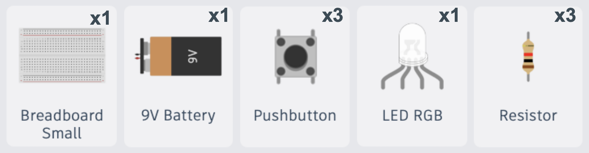

### Lesson 5: Controlling Light with RGB LEDs and Push Buttons

**What is a "Momentary Switch"?**
Think of a **Momentary Switch** like a doorbell. It is only "on" while you are pressing it down. As soon as you let go, it pops back up and turns the circuit "off". It is called "momentary" because it only does its job for the _moment_ that you are touching it!

---

### Activity 1: The "Goldilocks" Resistor Hunt

- **Objective**: Use your multimeter and different resistors to find the "just right" amount of power for your LED.
- **Concept**: Math gives us a starting point, but testing tells us the truth! Sometimes our parts have different needs than the general rules.
- **Activity**:
  1. Connect your 9V battery and RGB LED (Red pin only) to the breadboard.
  2. Try different resistors. If the light pops, the resistor is too small (too much current). If the light is too dim, the resistor is too big (not enough current).
  3. Use your multimeter to check the voltage across the resistor and the LED.
  4. **Documentation**: Write down the specific resistor value that makes your LED look "bright and happy" without getting too hot. This is your "Goldilocks" resistor!

<video
  src="video/L05/L05-Activity-1-Test-Red-LED.mp4"
  controls
  playsinline
  preload="metadata"
  width="100%"
  style="max-width: 900px; height: auto; border-radius: 8px;">
Your browser does not support the video tag.
<a href="video/L05/L05-Activity-1-Test-Red-LED.mp4">Download the video</a>.
</video>

---

### Activity 2: Building the Color Circuit

- **Objective**: Use your "Goldilocks" resistor value to build a safe circuit for each color.
- **Activity**:
  1. Repeat the "Goldilocks" test for the Green and Blue pins of the RGB LED.
  2. Document the perfect resistor for each color in your Engineer's Notebook.
  3. **Challenge**: Why do you think the Red pin needed a different resistor value than the Green or Blue pins?

<video
  src="video/L05/L05-Activity-2-Test-Each-LED.mp4"
  controls
  playsinline
  preload="metadata"
  width="100%"
  style="max-width: 900px; height: auto; border-radius: 8px;">
Your browser does not support the video tag.
<a href="video/L05/L05-Activity-2-Test-Each-LED.mp4">Download the video</a>.
</video>

---

### Activity 3: The "Momentary" Color Switch

- **Objective**: Use a **Push Button** to act as a gate for your color circuit.
- **Activity**:
  1. Keep your RGB LED and your "Goldilocks" resistors on the breadboard.
  2. Add a **Push Button** to your circuit.
  3. Connect your battery through the **Push Button**, then through your chosen resistor, and finally to the RGB pin.
  4. **Simulation Challenge**:
     - Start the simulation.
     - Click the button to see your color light up!
     - **Pro Tip**: Hold the **Shift-key** while clicking the button to "lock" it in the pressed position to test your circuit.
  5. **Documentation**: Describe what happens to the LED when you release the button. Why does it turn off immediately?

<video
  src="video/L05/L05-Activity-3-RGB-LED-PushButtons.mp4"
  controls
  playsinline
  preload="metadata"
  width="100%"
  style="max-width: 900px; height: auto; border-radius: 8px;">
Your browser does not support the video tag.
<a href="video/L05/L05-Activity-3-RGB-LED-PushButtons.mp4">Download the video</a>.
</video>
