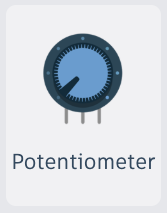

### Lesson 6: Mastering Light with Potentiometers

**What is a "Potentiometer"?**
Think of a Potentiometer (or "Pot") like a water faucet. A switch can only turn the water "on" or "off." A faucet lets you turn the handle to decide exactly how much water comes out. A Potentiometer lets you turn a knob to decide exactly how much electricity flows through your circuit—making your light dimmer or brighter!

**Pro Tip for TinkerCAD:** When you click on your Potentiometer, you might see a setting for Resistance. Don't worry about this—just set it to **10kΩ** (the most common size) and leave it there!

**New Concept: The Shared Ground Highway**
In this lesson, you will use more than one ground wire! It might look different, but it’s still simple:

- Think of the **black Ground rail (-)** like a big **Bus Stop**.
- Electricity leaves the battery, takes different paths (like through the Potentiometer or the LED), but all paths end at the same Bus Stop.
- As long as every ground wire touches the **black line**, every path successfully leads back to the battery to keep your circuit closed!

---

### Activity 1: The "Dimmer Switch"

- **Components Needed**:
  - 9V Battery
  - Breadboard
  - Standard LED (1)
  - Potentiometer (1)
  - Resistor (1)
  - Multimeter (1)
  - Jumper Wires
- **Objective**: Build a circuit where you can control the brightness of a single LED using a knob, and use a Multimeter to see how much current is flowing.
- **Wiring Setup**:
  1. Connect **Terminal 1** of your Potentiometer to the **Ground (-) rail (the black line)**.
  2. Connect **Terminal 2** of your Potentiometer to the **Power (+) rail (the red line)**.
  3. Connect the **Wiper (middle pin)** to your **Resistor**.
  4. To measure current, place your **Multimeter** in the path: connect the other side of the resistor to the **positive lead (red)** of the Multimeter, then connect the **negative lead (black)** of the Multimeter to the **positive leg** (longer leg) of your LED.
  5. Connect the **negative leg** (shorter leg) of your LED to the **Ground (-) rail (the black line)**.
  6. **Simulation Challenge**: Start the simulation, turn the knob, and watch both the LED brightness change and the Current (Amps) change on the Multimeter!
- **Note for Students**: You might notice the Potentiometer cannot adjust the circuit to exactly 20mA or the specific voltage your LED needs. That is perfectly okay! We are using the Multimeter just to see the change happening as we turn the knob.
- **Documentation**: As you turn the knob, what happens to the number on the Multimeter? Does it go up or down?

<video
  src="video/L06/L06-Activity-1-Potentiometer-2-GND-Wires.mp4"
  controls
  playsinline
  preload="metadata"
  width="100%"
  style="max-width: 900px; height: auto; border-radius: 8px;">
Your browser does not support the video tag.
<a href="video/L06/L06-Activity-1-Potentiometer-2-GND-Wires.mp4">Download the video</a>.
</video>

---

### Activity 2: The "Single-Color Mixer"

- **Components Needed**:
  - 9V Battery
  - Breadboard
  - RGB LED (1)
  - Potentiometer (1)
  - Resistor (1)
  - Jumper Wires
- **Objective**: Use one Potentiometer to control the brightness of a single color on the RGB LED to understand how the "Safety Brake" works.
- **The Golden Rule of LEDs**: Always include a fixed resistor in your circuit to act as a permanent safety brake.
- **The Big Question**: Why do I need to use a fixed Resistor if I already have a Potentiometer?
- **The Safety Brake Explanation**: Think of the Potentiometer as a volume knob. If you turn the knob all the way down, the Potentiometer's resistance disappears! The fixed Resistor acts as a "permanent safety brake" to make sure the electricity never gets too high and burns out your LED.
- **Activity**:
  1. **Calculate & Prep**: Look back at your notes from Lesson 5 to find the safe resistance value for one of the color pins on your RGB LED, or use the Ohm’s Law equation to calculate it again.
  2. **Layout**: Connect the 9V battery to the breadboard rails, place your RGB LED on the board, and connect its **Common Cathode** pin to the Ground (-) rail.
  3. **Position**: Place one resistor so it connects to one of the color pins (e.g., Red) and leave room to connect to the potentiometer.
  4. **Power Up**: Attach your potentiometer to the breadboard. Connect its outer terminals (Terminal 1 and Terminal 2) to the Power (+) and Ground (-) rails.
  5. **Bridge the Connection**: Connect the **Wiper (middle pin)** of the potentiometer to the color pin you chose, ensuring the wire connects _before_ it hits the resistor.
  6. **Test**: Start the simulation and turn the knob to see the color brighten and dim safely!

<video
  src="video/L06/L06-Activity-2-RGB-LED.mp4"
  controls
  playsinline
  preload="metadata"
  width="100%"
  style="max-width: 900px; height: auto; border-radius: 8px;">
Your browser does not support the video tag.
<a href="video/L06/L06-Activity-2-RGB-LED.mp4">Download the video</a>.
</video>

---

### Activity 3: The "Rainbow Mixer"

- **Objective**: Expand your circuit to control all three colors (Red, Green, and Blue) to create custom colors.
- **Activity**:
  1. **Expand**: Add the remaining two potentiometers and two resistors to your breadboard.
  2. **Wire**: Repeat the wiring steps from Activity 2 for the remaining two color pins on your RGB LED.
  3. **Explore**: Now that you have all three colors under your control, move the knobs to different positions.
  4. **The Challenge**: Can you create the color purple? How about yellow or teal? Turn the knobs to find these colors and discover the full spectrum!
  5. **Discovery**: What happens when all three knobs are turned to their maximum brightness? Does the light look white?
